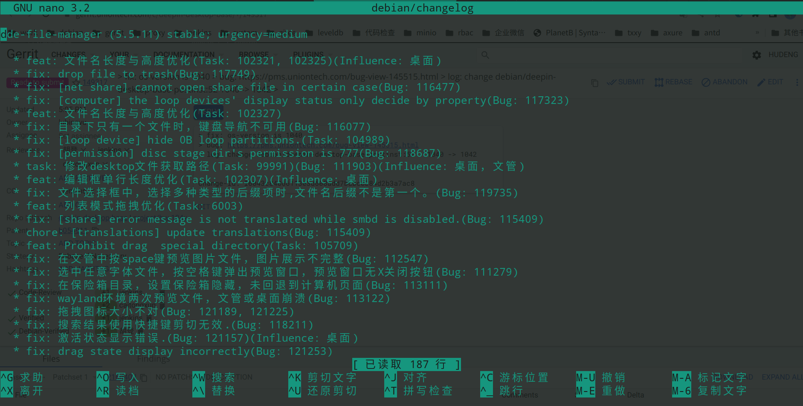

# git dch插件

基于 git-builderpackage工具制作的deepin的changelog更新插件。

## 安装

    apt install deepin-gbp-dch-plugins

## 使用

- 帮助信息获取：

        gbp deepin-changelog --help

- 使用例子：

    在包含`debian`目录和`git信息`的源码目录下执行如下命令：

        gbp deepin-changelog -N 5.5.11 -s 5.5.10

    `-N` 代表要提测的版本，`-s`代表上一个集成和发布版本，执行后会自动收集两个版本之间的`git commit提交`信息，并更新到`debian/changelog`中，执行后显示效果如下图所示：
    

    确认无误后执行`Ctrl+X`即可保存退出，其他功能待熟悉各位童鞋的发掘。

## 备注

- 本插件参考`git-buildpackage`的`dch`插件实现。
- 本插件仓库地址：

        deb [trusted=yes] https://ci.deepin.com/repo/topics/beige/deepin-dch/ unstable main
